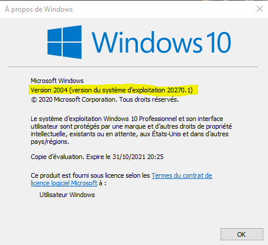
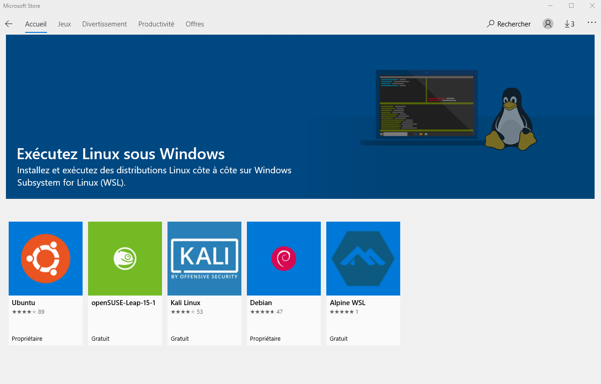

# **WSL Installation**

# *Manual installation*

## Step 1: Enable WSL
Open powershell in administrator mod (windows key + 'X'):

```powershell
dism.exe /online /enable-feature /featurename:Microsoft-Windows-Subsystem-Linux /all /norestart
```
---
<br>

## Step 2: Check config for WSL
To update to WSL 2, you must be running Windows 10.

+ For x64 systems: Version 1903 or higher, with Build 18362 or higher.
+ For ARM64 systems: Version 2004 or higher, with Build 19041 or higher.
+ Builds lower than 18362 do not support WSL 2. Use the Windows Update Assistant to update your version of Windows.

In powershell enter:

```powershell
winver
```


---
<br>

## Step 3: Enable Virtual Machine feature
In powershell enter:

```powershell
dism.exe /online /enable-feature /featurename:VirtualMachinePlatform /all /norestart
```

**Restart** your machine to complete the WSL install and update to WSL 2.

---
<br>

## Step 4: Download the Linux kernel update package
Download and install latest package:
+ [WSL2 Linux kernel update package for x64 machines](https://wslstorestorage.blob.core.windows.net/wslblob/wsl_update_x64.msi)

---
<br>

## Step 5: Set WSL 2 as your default version
Open PowerShell and run this command to set WSL 2 as the default version when installing a new Linux distribution:

```powershell
wsl --set-default-version 2
```

---
<br>

## Step 6: Install your Linux distribution of choice
Open the [Microsoft Store](https://aka.ms/wslstore) and select your favorite Linux distribution.
<br>



<br>

The first time you launch a newly installed Linux distribution, a console window will open and you'll be asked to wait for a minute or two for files to de-compress and be stored on your PC. All future launches should take less than a second.

You will then need to create a user account and password for your new Linux distribution.

You can check the WSL version assigned to each of the Linux distributions you have installed by opening the PowerShell command line and entering the command (only available in Windows Build 18362 or higher): `wsl -l -v`


```powershell
wsl --list --verbose
```
In case of multiple distributions, you can set a specific ditribution on a targeted version of wsl by running:

```powershell
wsl --set-version <distribution name> <versionNumber>
```

Example:

```powershell
wsl --set-version Debian 2
```

Additionally, if you want to make WSL 2 your default architecture you can do so with this command:

```powershell
wsl --set-version 2
```

---
<br>

## -> [Docker installation for Windows](./2---Docker-installation-for-Windows.md)
