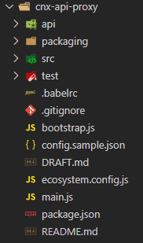
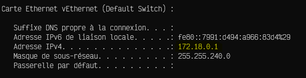
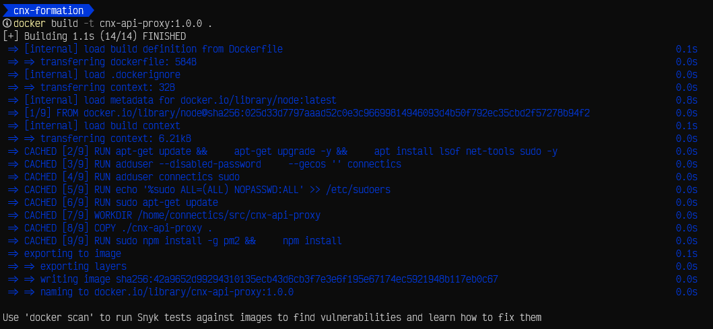
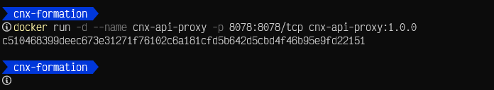
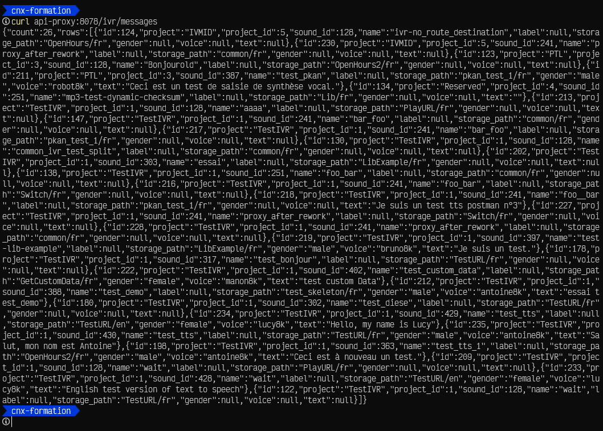
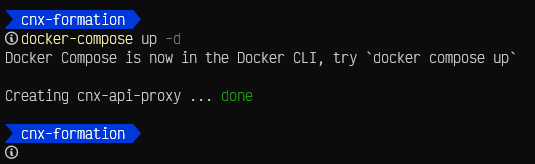

# Requirements

+ [WSL2](./1----WSL-Installation.md)
+ [Docker](./2---Docker-installation-for-Windows.md)

<br>

# Setup
## Get CNX-API-PROXY

Clone *`cnx-api-proxy`* from terminal:


```bash
git clone git@github.com:INTERACT-IV/cnx-api-proxy.git
```

You should get the following structure



<br>

---

## Configuration

### ***Environment variables***

<br>

#### CNX-API-PROXY

In powershell terminal type:
```powershell
ipconfig
```

Look for `Carte Ethernet vEthernet (Default Switch)` to get Docker IP address



Then add it to your hosts file located in [C:\Windows\System32\drivers\etc\hosts](file://C:/Windows/System32/drivers/etc/hosts)

`172.18.0.1 api-proxy`

+ Development mode

  Create `config.json` file in the root folder, `connectors.json` and `targets.json` file in `/api/ivr` folder from terminal:

  ```bash
  touch config.json ./api/ivr/connectors.json ./api/ivr/targets.json
  ```

  Add the following configuration in the `config.json` file:
  ```json
  {
    "host": "0.0.0.0",
    "ignores": [
      "eventsdb",
      "ivcdrdb",
      "ivmedia",
      "messaging"
    ],
    "logs": {
      "level": "debug",
      "path": "./logs"
    },
    "port": 8078
  }
  ```

  Add the following configuration in the `connectors.json` file:
  ```json
  {
    "mysql": {
      "connectionLimit": 10,
      "host": "10.199.8.73",
      "user": "interactiv",
      "password": "ics427!",
      "database": "ivrdb"
    }
  }
  ```

  Add the following configuration in the `targets.json` file:
  ```json
  {
    "macros": {
      "prefix": "api",
      "resources": {
        "assign_ivr": [ "POST" ],
        "get_dialplan": [ "GET" ],
        "get_ivr": [ "GET" ],
        "get_ivr_list": [ "GET" ],
        "macros": [ "GET" ],
        "lua?ws": [ "GET", "POST" ],
        "push_ivr": [ "POST" ]
      },
      "url": "http://vs-inf-dev-fsw-fr-302:8080"
    },

    "self": {
      "prefix": "ivr",
      "resources": {
        "languages": [ "GET" ],
        "macros": [ "DELETE" ],
        "message": [ "POST" ],
        "projects": [ "GET", "POST" ],
        "sound": [ "GET", "POST" ],
        "tables": [ "GET", "PATCH", "POST" ],
        "tts": [ "GET", "POST" ]
      },
      "url": "http://localhost:8078"
    },

    "tts": {
      "prefix": "rest",
      "resources": {
        "tts/v1": [ "GET", "POST" ],
        "tts_files/v1": [ "GET", "POST" ]
      },
      "url": "https://apiqua.interactivmanager.net"
    }
  }
  ```
+ Production mode

  Copy content `config.json` file in `/etc/interact-iv/cnx-api-proxy.json` folder from terminal:

  ```bash
  sudo mkdir /etc/interact-iv && sudo cp config.json /etc/interact-iv/cnx-api-proxy.json
  ```

#### Docker
Create `.dockerignore, docker-compose.yml, .Dockerfile` just outside the root folder from terminal:

```bash
touch .dockerignore docker-compose.yml .Dockerfile
```

Add the following to:

+ .dockerignore
  ```.dockerignore
  Dockerfile
  package-lock.json
  node_modules
  ```
+ docker-compose.yml
  ```yaml
  version: '3.9'

  services:
    cnx-api-proxy:
      build:
        context: .
        dockerfile: Dockerfile
      image: cnx-api-proxy
      container_name: cnx-api-proxy
      ports:
        - 8078:8079
      working_dir: /home/connectics/src/cnx-api-proxy
      command: sh -c "npm run watch && pm2 logs cnx-api-proxy"
      volumes:
        - ./:/home/connectics/src/cnx-api-proxy
  ```

  <br>

  | Key | Description |
  | --- |---|
  | **`version`** | Compose file format compatibility with Docker Engine release, here 19.03.0+.<br>[Check compatibilty.](https://docs.docker.com/compose/compose-file/#compose-and-docker-compatibility-matrix) |
  | **`services`** | Application definition. |
  | **`cnx-api-proxy`** | Container Services name. |
  | **`build`** | Configuration options that are applied at build time. Can be a string. |
  | **`context`** | Either a path to a directory containing a Dockerfile, or a url to a git repository.<br>When the value supplied is a relative path, it is interpreted as relative to the location of the Compose file. This directory is also the build context that is sent to the Docker daemon.<br>Compose builds and tags it with a generated name, and uses that image thereafter.<br>**Example:**<br>build:<br><dd>context: . |
  | **`dokerfile`** | Alternate Dockerfile.<br>Compose uses an alternate file to build with. A build path must also be specified.<br>**Example:**<br>build:<br><dd>context: .<br><dd>dockerfile: Dockerfile-alternate |
  | **`image`** | Specify the image to start the container from. Can either be a repository/tag or a partial image ID<br><br>**Example:**<br>image: redis |
  | **`container_name`** | Specify a custom container name, rather than a generated default name.<br><br>**Example:**<br>container_name: cnx-api-proxy |
  | **`ports`** | Expose ports.<br><br>**Example:**<br>ports:<br><dd> - 8078:8079<dd/>|
  | **`working_dir`** | Set the working dir.<br><br>**Example:**<br>working_dir: /home/connectics/src/cnx-api-proxy |
  | **`command`** | Override the default command.<br><br>**Example:**<br>sh -c "npm run watch && pm2 logs cnx-api-proxy"<br><br>*The command can also be a list, in a manner similar to dockerfile*:<br>[ "npm", "run watch &&", "pm2", "logs cnx-api-proxy" ] |
  | **`volumes`** | Mount host paths or named volumes, specified as sub-options to a service.<br>You can mount a host path as part of a definition for a single service, and there is no need to define it in the top level volumes key.<br>But, if you want to reuse a volume across multiple services, then define a named volume in the top-level volumes key. Use named volumes with services, swarms, and stack files.<br> |

  <br>

+ Dockerfile
  ```Dockerfile
  FROM node

  RUN apt-get update && \
      apt-get upgrade -y && \
      apt install lsof net-tools sudo -y

  RUN adduser --disabled-password \
      --gecos '' connectics

  RUN adduser connectics sudo

  RUN echo '%sudo ALL=(ALL) NOPASSWD:ALL' >> \
  /etc/sudoers

  USER connectics

  RUN sudo apt-get update

  WORKDIR /home/connectics/src/cnx-api-proxy

  COPY ./cnx-api-proxy .

  RUN sudo npm install -g pm2 && \
      npm install

  USER connectics

  VOLUME [ "/cnx-api-proxy" ]

  CMD npm run watch && pm2 logs cnx-api-proxy
  ```

  <br>

  Basic Dockerfile instruction:

  | Instruction | Description |
  | --- |---|
  | **`FROM`** | Set the *`baseImage`* to use for subsequent instructions.<br>*`FROM`* must be the first instruction in a *`Dockerfile`*.<br><br>**Example**:<br>FROM baseImage<br>FROM baseImage@digest |
  | **`WORKDIR`** | Set the working directory for any subsequent *`ADD`*, *`COPY`*, *`CMD`*, *`ENTRYPOINT`*, or *`RUN`* instructions that follow it in the *`Dockerfile`*.<br><br>**Example**:<br>WORKDIR /path/to/workdir<br>WORKDIR relative/path |
  | **`COPY`** | Copy files or folders from *`source`* to the *`dest`* path in the image's filesystem.<br><br>**Example**:<br>COPY hello.txt /absolute/path<br>COPY hello.txt relative/to/workdir |
  | **`RUN`** | Execute any commands on top of the current image as a new layer and commit the results.<br>For your container to keep running after being build, ensure your run *`CMD`* with a command that does not exit its process.<br><br>**Example**:<br>RUN apt-get update && apt-get install -y curl |
  | **`CMD`** | Provide defaults for an executing container. If an executable is not specified, then *`ENTRYPOINT`* must be specified as well. There can only be one *`CMD`* instruction in a *`Dockerfile`*.<br><br>**Example**:<br>CMD [ "/bin/ls", "-l" ] |


## USAGE
### Build CNX-API-PROXY

**Example:**
To build an image the command look like:
```bash
docker build [ OPTIONS ] PATH | URL | -

```
In terminal enter:
```bash
docker build -t cnx-api-proxy:1.0.0 .
```

The result looks like this:



---

### Run CNX-API-PROXY image with docker command

**Example:**
To run an image the command look like:
```powershell
docker run [OPTIONS] IMAGE [COMMAND] [ARG...]

```
In terminal enter:
```powershell
docker run -d --name cnx-api-proxy -p 8078:8078/tcp cnx-api-proxy:1.0.0
```

The result will return a container ID and look like this:



You can now test it. In terminal enter:

```powershell
curl api-proxy:8078/ivr/messages
```



---

### Run CNX-API-PROXY image with docker-compose command

In terminal enter:
```powershell
docker-compose up -d
```

The result looks like this:


