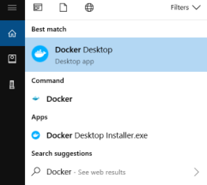

Download [Docker Desktop for windows](https://desktop.docker.com/win/stable/amd64/Docker%20Desktop%20Installer.exe).

The Docker Desktop installation includes Docker Engine, Docker CLI client, Docker Compose, Notary, Kubernetes, and Credential Helper.

## Install Docker Desktop on Windows
 

+ Double-click Docker Desktop Installer.exe to run the installer.
  When prompted, ensure the Enable Hyper-V Windows Features or the Install required Windows components for WSL 2 option is selected on the Configuration page.

+ Follow the instructions on the installation wizard to authorize the installer and proceed with the install.

+ When the installation is successful, click Close to complete the installation process.

+ If your admin account is different to your user account, you must add the user to the docker-users group. Run Computer Management as an administrator and navigate to Local Users and Groups > Groups > docker-users. Right-click to add the user to the group. Log out and log back in for the changes to take effect.

## Start Docker Desktop
 
Docker Desktop does not start automatically after installation. To start Docker Desktop, search for Docker, and select Docker Desktop in the search results.

When the whale icon in the status bar stays steady, Docker Desktop is up-and-running, and is accessible from any terminal window.

If the whale icon is hidden in the Notifications area, click the up arrow on the taskbar to show it. To learn more, see Docker Settings.

When the initialization is complete, Docker Desktop launches the onboarding tutorial. The tutorial includes a simple exercise to build an example Docker image, run it as a container, push and save the image to Docker Hub.

 

## What's next:
-> [Docker CNX-API-PROXY](./3---Docker-CNX-API-PROXY.md)
